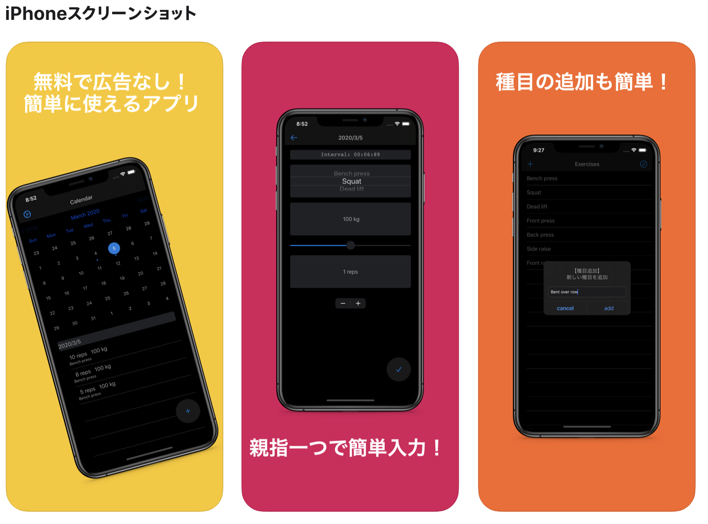

# 作成したアプリ

## App URL
https://apps.apple.com/jp/app/gymnote/id1501710635

## アプリの特徴
### シンプルで使いやすい

 - 複数回の画面遷移を必要とせず、すぐに記録をとれる
 - 記録の入力にテキストを打たなくて良い
 - 記録がすぐに見え、進捗が見やすい
 - 広告がないので入力の邪魔にならない

## 使用した技術(箇条書き)

- MVVM
- RxSwift
- DIパターン
- Realm
- Bitrise
- git-flow

## 使い方
 
> `$ pod install`

## 意識した点
### アプリのUI/UX
ジムで使いやすいように親指一つで使えるようにした  
結果をすぐに記録できるように画面遷移を少なくした  
前回入力した値を保持し、次回入力時に再度設定しなくて住むようにした  
（たとえば：ベンチプレス　100kg　5repsを保持し、	repsだけ変更すれば入力できる）  
トレーニング種目を自由に追加できるようにした  
（既存のアプリでは限られた種目しか選択できない）  
### 技術面
  MVVMによって実装し、FatViewControllerをさけた  
  DIパターンを採用しテストが書きやすいようにした  
    （テストは鋭意実装＆追加中）  
  Bitriseを用いてテスト自動化を行っている  
  
## 使用したライブラリ

[RxSwift](https://github.com/ReactiveX/RxSwift)　リアクティブプログラミング用  
 [RxCocoa](https://github.com/ReactiveX/RxSwift/tree/master/RxCocoa)　リアクティブプログラミング用  
 
[RealmSwift](https://realm.io/docs/swift/latest)　ネイティブアプリDB操作用  
[RxRealm](https://github.com/RxSwiftCommunity/RxRealm) 上記のものをRxSwiftで扱うライブラリ  
[RxDataSources](https://github.com/RxSwiftCommunity/RxDataSources)　TableViewをRxSwiftで扱うライブラリ  

[RxTest](https://github.com/ReactiveX/RxSwift/tree/master/RxTest)  RxSwiftのテスト用  
[RxBlocking](https://github.com/ReactiveX/RxSwift/tree/master/RxBlocking)　RxSwiftのテスト用  

[SwiftLint](https://github.com/realm/SwiftLint)　校正ツール  
[R.swift](https://github.com/mac-cain13/R.swift)　ハードコーディングによるスペルミス対策  

[FSCalendar](https://github.com/WenchaoD/FSCalendar)　カレンダーライブラリ  
[SwiftDate](https://github.com/malcommac/SwiftDate) 日付を扱うライブラリ  
[MaterialComponents/Buttons](https://material.io/develop/ios/components/buttons/)　FABのライブラリ  
[Alertift　UIAlertController](https://github.com/sgr-ksmt/Alertift)のラッパー  

## 今後の予定
テストコードの整備  
UIの変更による使いやすさの向上  
トレーニング予定記録＆通知機能の追加  
